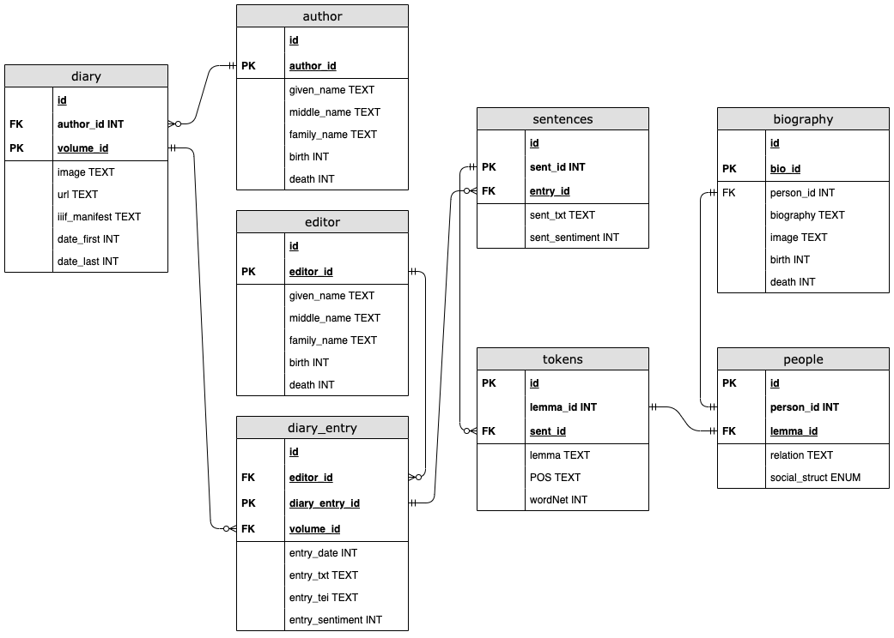

# Database Model for Emma B. Andrews Diaries

# Introduction

Emma B. Andrews was a 20th century figure involved with the archaeological study of Egyptian Culture. During her life, Emma composed a collection of journals. We will assume that Emma B. Andrews was the author of each journal. There are currently 19 journal volumes. Each volumes contains n amount of entries. Within each entries, there are various social relationships we want to query and explore. For this reason, we will store a tei-xml object in its own table, with an author ID=Emma. Whereas our current interest is to map and query the social networks of Emma B. Andrews, we also want to model the database in such a way that future research can build onto the existing database, not recreate it.

## Modeling the Database

## SQLite3 Implementation

For development and testing, we will use a SQLite3 database. This prevents the immediate need for server access. We will have to simplify some data fields, but the above model is programmatically available. Navigate to the directory, `sql_db`, in your terminal. Use the command `make` to run `makefile`. The database is torn down and recreated.