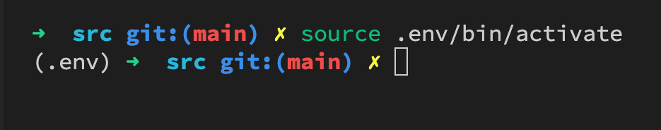
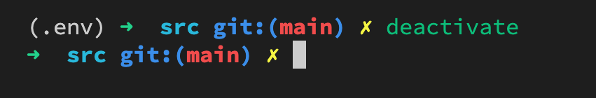

# Processing TEI with Python

## Introduction

To process the TEI documents, we will use the Python programming language. To ensure our work is system agnostic (i.e., can work on either Mac, Linux, or Windows), we will utilize a virtual environment. The following explains more about the value of using a virtual environment and how to set up your machine to work with the virtual environment.

## Understanding Python Virtual Environments

To run the Python scripts in `src`, please follow the below instructions. The following instructions walk the user through the steps to create a Python virtual environment: `venv`. The advantage of running a virtual environment is to ensure that the scripts can perform on any platform (on either MacOS, Windows, or Linux). Thus, think of the virtual environment as a contained box, independent from any one person's computer. Once the virtual environment is created and activated, the scripts here will utilize the virtual environment to the contents of `dairy-volumes` _as expected_. Let's unpack the expectations in terms of how the virtual environment relates to different versions of Python and Python Modules.

The Python programming language has various versions. The noticeable difference among Python versions is found in Python 2 and Python 3. In this project, we will be using Python 3. If you are running a Mac or Linux, you already have Python installed on your system. If you are running Windows, you need to install Python (see instructions [here](https://docs.python.org/3/using/windows.html)). You can check which version of Python your _system_ is running by opening a terminal window and typing, `Python --version`. When I run this command, my system tells me that I am running Python 2.7.16. If I were to run the following command, `Python3 --version`, I get back, Python 3.9.1. This is one reason why we want to standardize a development environment with a virtual environment. By standardizing a virtual environment, we can ensure that we are all working with the same version of Python and same versions of Python modules.

A huge advantage of Python is the large library of [modules](https://docs.python.org/3/tutorial/modules.html) available to install. Modules extend the functionality of Python by providing various functions for specific computational tasks. Modules also have versions, which can further complicate processing code across multiple machines. For example, let's imagine that we wanted to use the module [Natural Language Toolkit](https://www.nltk.org/install.html) or `nltk` for short. Currently, the `nltk` module is at version 3.6.2. If we developed code depending on the various features of `nltk` 3.6.2, yet another version of `nltk` was installed, our Python scripts might error and fail to process the code.

To manage the complexities of Python versions AND versions of installed modules, we will use the elegant AND simple solution of a virtual environment. The following will walk you through the steps to install a virtual machine and required Python modules.

## Installing a Virtual Environment

First, navigate to the `src` folder in your terminal:

* Linux or MacOS
  * `cd src/`
* Windows
  * `cd .\src\`

Second, run the following command from the terminal. Be sure to add the dot before `env`. This makes the folder invisible on a Mac, but also the `.gitignore` will not push the contents of `.env` to github.

* Linux or MacOS
  * `Python3 -m venv .env`
* Windows
  * `c:\>python -m venv c:\path\to\.env`

That's it! You have installed a Python virtual environment. If you see some 5,000+ files to push to github, you have likely overlooked the dot in `.env`. Just delete the virtual environment folder, and redo the process.

Now, we need to activate the virtual environment and install the Python modules. This is super easy.

## Install Python Modules (Dependencies)

To install the Python modules or the necessary dependencies, you need to activate the virtual environment, `venv`. Activating the virtual environment means that you will be working from the Python version of the virtual environment. When you created the virtual environment, Python created an instance of Python with the core Python modules. We will want to use modules beyond those prepackaged with Python. It is rather easy to install the additional modules.

### Activate Virtual Environment

First, we need to activate our virtual environment. To activate the virtual environment, run the following terminal command:

* MacOS
  * `source .env/bin/activate`
* Windows 10
  * `C:\> .env\Scripts\Activate.ps1`

Once the virtual environment is activated, you will see the environment name on the command line:

Anytime we see the environment name on our command line, we are working with the Python version of the virtual environment. The command `python --version` displays the version of Python of the virtual environment.

### Install Modules (Dependencies)

To install the modules (or dependencies), we only need to run the following terminal command:

`python -m pip install -r requirements.txt`

Once all the modules are install, you can deactivate the Python virtual environment with `deactivate`:

## Summary

### Create Virtual Environment

`python -m venv <name>` -- I usually use a dot before the environment `<name>`, like, `.env`.

### Activate Environment

`source .env/bin/activate`

### Install Modules

`python -m pip install -r requirements.txt`

### Deactivate

`deactivate`
